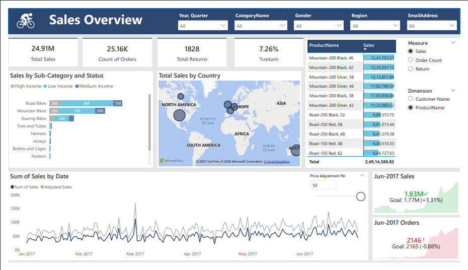
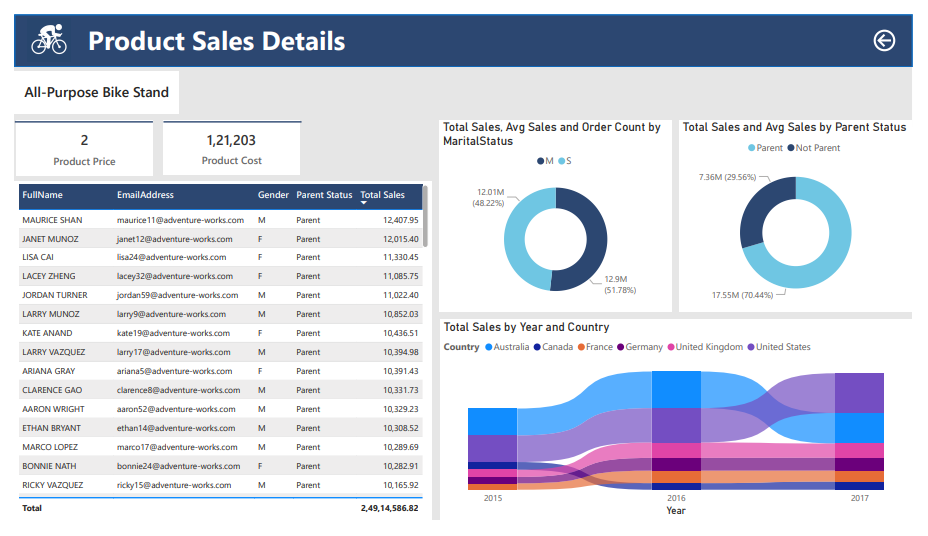
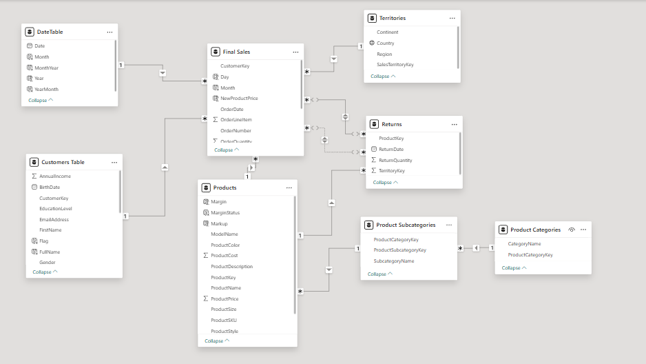

# powerbi-sales-performance-dashboard
Interactive Power BI Sales &amp; Returns Analytics Dashboard using DAX, data modeling, drill-through and What-If parameters.
# Power BI Sales & Returns Analytics Dashboard

## 📊 Project Overview

An interactive Power BI Sales & Returns Analytics Dashboard developed to analyze sales performance, order trends, product performance, customer segments, returns and geographical sales distribution.

The project demonstrates practical application of Power BI, DAX, data modeling, relationships, drill-through analysis, What-If parameters, KPI development and interactive business reporting.

---

## 🎯 Business Objective

The objective was to transform sales, customer, product and returns data into an interactive business intelligence solution that enables stakeholders to:

- Monitor overall sales and order performance
- Analyze product and sub-category performance
- Identify customer segments and purchasing patterns
- Track return performance
- Compare actual sales against business goals
- Perform price adjustment scenario analysis
- Analyze sales across countries and time periods
- Drill down from summary-level KPIs to detailed product/customer information

---

## 🛠️ Tools & Technologies

- Power BI Desktop
- DAX
- Power Query
- Data Modeling
- Star Schema
- Drill-Through
- What-If Parameters
- Time Intelligence
- Interactive Slicers
- KPI Visualization
- Geographic Analysis
- Data Visualization

---

## 🗂️ Data Model

The Power BI model consists of 8 interconnected tables:

1. Final Sales
2. Customers
3. Products
4. Returns
5. Date Table
6. Territories
7. Product Subcategories
8. Product Categories

The model uses relationships between transactional and dimensional tables to support dynamic filtering and analysis.


---

## 📈 Key KPIs

The dashboard provides the following business KPIs:

| KPI | Value |
|---|---:|
| Total Sales | 24.91M |
| Order Count | 25.16K |
| Total Returns | 1,828 |
| Return Rate | 7.26% |

---

## 🔍 Dashboard Features

### Sales Overview

The main dashboard provides:

- Total Sales
- Order Count
- Total Returns
- Return Rate
- Sales by Country
- Sales by Sub-Category
- Sales Trends
- Top Products
- Customer segmentation
- Interactive filters

### Product Sales Details

A dedicated drill-through page provides detailed product-level analysis including:

- Product Price
- Product Cost
- Customer details
- Gender
- Parent Status
- Customer-level Sales

---

## ⚙️ Power BI Techniques Used

### DAX

Created DAX measures for:

- Sales analysis
- Order analysis
- Return analysis
- Return percentage
- Adjusted Sales
- Goal/target comparison
- Average sales
- Time-based analysis

### Data Modeling

Implemented relationships between sales, product, customer, territory, date and category-related tables to enable cross-filtering and accurate analysis.

### Drill-Through

Implemented drill-through functionality to move from high-level dashboard analysis to detailed product/customer-level analysis.

### What-If Parameter

Implemented a Price Adjustment (%) parameter to perform scenario analysis and evaluate the potential impact of price changes on sales.

### Time Intelligence

Used a dedicated Date Table to analyze sales trends across different time periods.

### Dynamic Analysis

Used slicers and parameter controls to allow users to dynamically change dimensions and measures for exploratory analysis.

---

## 💡 Business Insights

The dashboard enables analysis of:

- Top-performing products and product sub-categories
- Sales contribution by country
- Sales trends over time
- Customer segmentation by demographic attributes
- Parent vs. Non-Parent customer sales
- Gender-based sales distribution
- Return performance
- Actual sales vs. business goals
- Potential impact of price adjustments

---

## 📊 Sample Dashboard Metrics

For June 2017, the dashboard shows:

- Sales: 1.83M
- Sales Goal: 1.77M
- Sales variance: +3.31%
- Orders: 2,146
- Order Goal: 2,165
- Order variance: -0.88%

---

## 📁 Repository Structure

```text
powerbi-sales-performance-dashboard/
│
├── README.md
├── Sales_Overview.png
├── Product_Details.png
├── Tables_Relationship.png
└── Sales_Performance_Dashboard.pbix
```

---

## 📸 Dashboard Preview

### Sales Overview



### Product Sales Details



### Data Model


